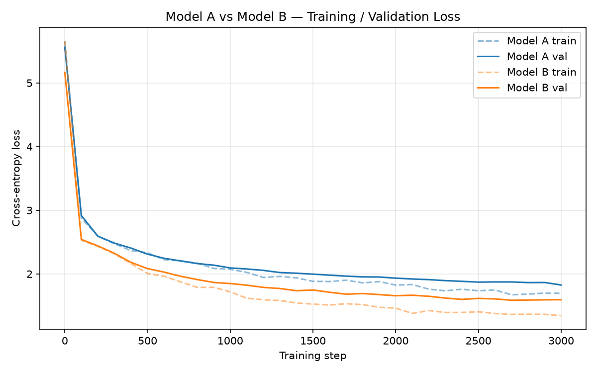

# Mini-Shakespearean LLM



A from-scratch GPT-style transformer (PyTorch), trained on the tinyshakespeare corpus in two
configurations, benchmarked against each other and against a production LLM (Gemini 2.5 Flash).

## Team

| Name | Role |
|---|---|
| Shashank Reddy Gillella | Architecture & training loop (model.py, train.py) |
| Shashank Reddy Gillella | Tokenizer & data pipeline |
| Meghansh Pochampally | Evaluation & benchmarking (quantitative + qualitative) |
| Meghansh Pochampally | Annotation diagram, README, report assembly |

*(Every member is individually responsible for understanding the full architecture, tokenizer,
and tensor shapes — see "Job Market Readiness Clause" in the assignment.)*

## Repo layout

```
/my-transformer/     model.py, tokenizer.py, train.py, generate.py, plot_losses.py
/evaluation/          benchmark_quantitative.py, benchmark_qualitative.py
requirements.txt
README.md
```

## Setup

```bash
pip install -r requirements.txt
```

Dataset (`input.txt`, tinyshakespeare) is included in the repo root.

## Model configs

| | Model A (baseline) | Model B (scaled) |
|---|---|---|
| Layers | 2 | 4 |
| Heads | 4 | 8 |
| Embedding dim | 128 | 256 |
| Context length | 64 | 128 |
| Params | ~469K | ~3.3M |

## Results

Both models trained for 3,000 steps on a 90/10 train/val split.

| Model | Final Train Loss | Final Val Loss | Perplexity |
|---|---|---|---|
| A | 1.6951 | 1.8417 | 6.31 |
| B | 1.3448 | 1.5819 | 4.86 |

Model B converges to lower loss and perplexity, consistent with its larger capacity and longer
context window, at the cost of a wider train/val gap (mild overfitting on this small a dataset).

**Sample generation** (prompt: `"To be, or not to "`, Model B):
> To be, or not to use that thy married / That be't: prayers by the streets here / That I have
> broken him that this, I should speak babe! / My trade my titurns with so good he

Full qualitative comparison (Model A vs Model B vs Gemini 2.5 Flash, 4 prompts) is in the report
and reproducible via `evaluation/benchmark_qualitative.py`.

## Train

```bash
cd my-transformer
python train.py --config A --steps 3000
python train.py --config B --steps 3000
python plot_losses.py    # regenerates loss_curve.png
```

## Generate

```bash
cd my-transformer
python generate.py --config A --prompt "To be, or not to " --tokens 150
python generate.py --config B --prompt "To be, or not to " --tokens 150
```

## Evaluate

Quantitative (loss + perplexity on held-out data):

```bash
cd evaluation
python benchmark_quantitative.py
```

Qualitative (3-model comparison table, requires `GEMINI_API_KEY` for the Gemini column):

```bash
export GEMINI_API_KEY=your_key_here
cd evaluation
python benchmark_qualitative.py
```

## Design notes

- **Tokenizer**: byte-level (`vocab_size=256`), see `my-transformer/tokenizer.py`.
- **Architecture deltas from microgpt.py**: `nn.Module` + autograd instead of hand-rolled
  `Value.backward()`; vectorized `torch.matmul` instead of scalar loops; RMSNorm + ReLU (same
  choices as the blueprint).
- **Failure modes observed**: Model A hallucinates plausible-but-fictional character names;
  Model B holds coherence slightly longer but still degrades over long spans; Gemini 2.5 Flash
  produces near-exact reproductions of the source text, highlighting the generation-vs-memorization
  ambiguity at production scale. Full analysis in the report.
